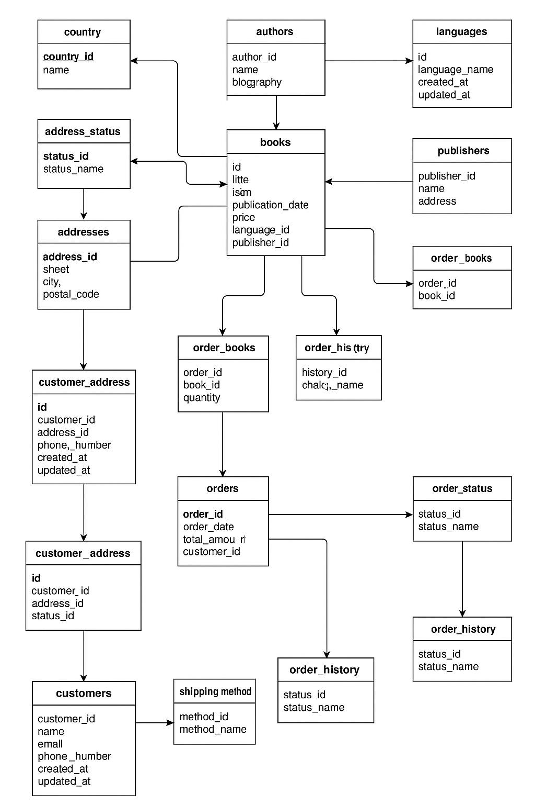

# Bookstore Database Project

## Overview
This project is designed to implement a comprehensive database for a bookstore. It includes key tables to manage books, authors, languages, publishers, customers, addresses, and orders, along with their respective relationships.

---

## ERD (Entity Relationship Diagram)

Below is the entity relationship diagram representing the structure of the bookstore database:

---

## Database Schema

The database consists of the following tables:

- **Books**: Contains details about each book, including title, ISBN, publication date, and price.
- **Authors**: Stores information about authors, including name, biography, and date of birth.
- **Languages**: Lists the languages available for the books.
- **Publishers**: Holds details about publishers, including name, address, and contact information.
- **Customers**: Contains customer details such as name, email, and phone number.
- **Addresses**: Stores address details including street, city, state, and postal code.
- **Orders**: Manages order details, including order date, total amount, and customer ID.
- **Relationships**: Defines many-to-many relationships between books and authors, as well as other necessary relationships.

---

## Setup Instructions

1. **Database Creation**: Use the SQL scripts located in the `sql/tables` directory to create the necessary tables in your database.
2. **Seeding Data**: After creating the tables, run the SQL script in `sql/seed/seed-data.sql` to insert initial data for testing and development.

---

## Additional Information

Ensure that you have the necessary database management system installed and configured to execute the SQL scripts. This project is designed to facilitate the management of a bookstore's operations efficiently.
